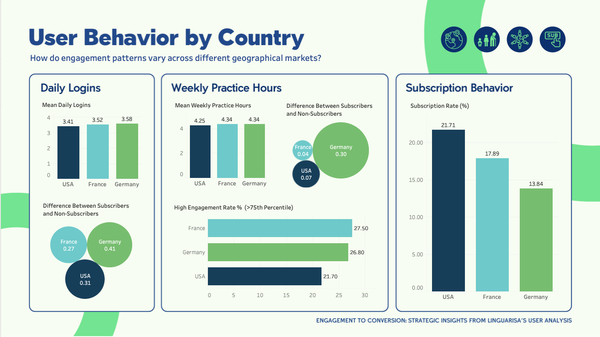
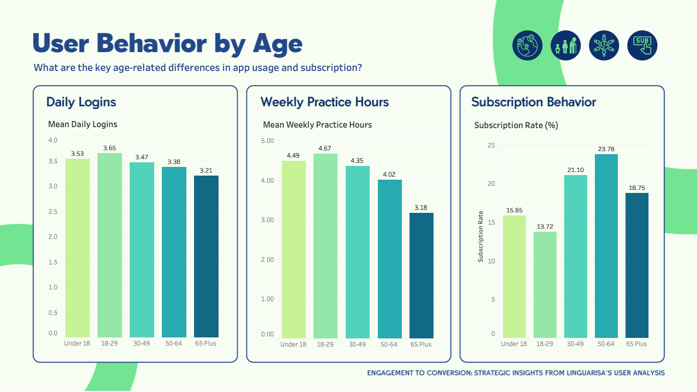
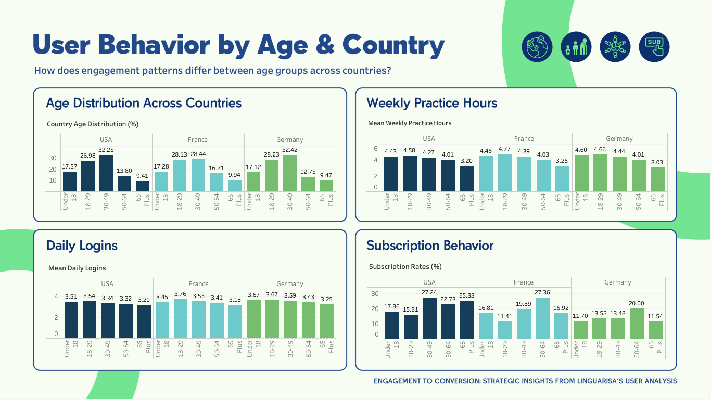
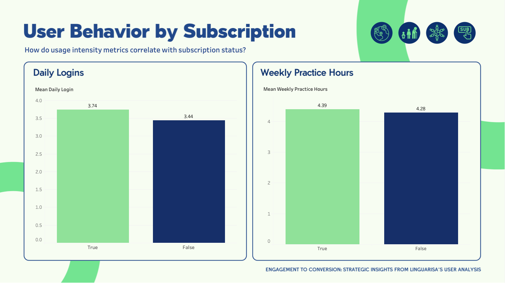

# Engagement to Conversion: Strategic Insights from LinguaRisa's User Analysis
**Author:** Product Name: LinguaRisa  
**Output:** HTML Document

## Background and Overview
LinguaRisa, founded in 2021, is a global ed-tech company dedicated to teaching the Spanish language through its mobile app. The company has collected data on user demographics, engagement metrics, and subscription behavior across the USA, Germany, and France. The primary goal of this analysis is to understand user behavior by geography and age group to determine whether a targeted marketing campaign is needed.

## Key Analysis Areas
#### **1.	How do engagement patterns vary across different geographical markets?:**  
  Compares user behavior (e.g., daily logins, weekly practice hours) and subscription rates across the USA, Germany, and France to identify which regions offer the most potential for growth.
  
#### **2.	What are the key age-related differences in app usage and subscription?:**  
  Examines how age correlates with user activity (daily logins, weekly practice hours) and subscription likelihood, providing insights into age-based marketing opportunities.  
  
#### **3.	How does engagement patterns differ between age groups across countries?:** 
  Examine user differences in age groups of different countries to uncover age-group based country differences to inform country specific age-based strategies.
  
#### **4.	How do usage intensity metrics correlate with subscription status?:**  
  Investigates differences in behavior between paid and free users, segmented by age and country, to identify engagement patterns that drive satisfaction among subscribers and potential upgrades among free users.

## Data Structure Overview
#### The dataset contains 2,000 user records over five variables:

1. **Age Group:**  
   Categorical variable with five levels: **Under 18**, **18-29**, **30-49**, **50-64**, **65 Plus**.

2. **Country:**  
   Categorical variable with three levels: **USA**, **France**, **Germany**.

3. **Daily Logins:**  
   Continuous variable representing the average number of daily logins.

4. **Weekly Practice Hours:**  
   Continuous variable indicating average hours of practice per week.

5. **Subscription Status:**  
   Binary variable where **1** indicates paid subscribers and **0** indicates free users.

## Methodology

#### **1. Descriptive Tables**: 
Displayed mean and median values for each engagement metric (daily logins and weekly practice hours) by country, age, and subscription status to evaluate central tendencies.

#### **2. ANOVA Test:** 
Used to assess differences in daily logins and weekly practice hours across the USA, Germany, and France. Effect sizes (η²) were calculated to evaluate the practical significance of observed differences.

#### **3. Chi-Squared Test with Cramer's V:** 
Conducted to compare subscription rates and the age group distribution across countries, with Cramer’s V used to measure effect sizes.

#### **4. T-Tests and Effect Sizes:** 
Pairwise T-tests performed with Bonferroni corrections to examine differences in daily logins and weekly practice hours between age groups. Cohen’s d was used to measure effect sizes.

#### **5. Fisher's Exact Test:** 
Applied to compare subscription rates across age groups. The Fisher's test is used instead of the Chi-squared test with Cramer's V due to small sample sizes for the subscribed group. Standardized residuals were analyzed to identify deviations from expected frequencies.

#### **6. Linear and Multiple Regression:** 
Conducted to explore the relationships between engagement metrics (daily logins and weekly practice hours) and age. Country and subscription rates are not evaluated as other analyses have captured most of the trends. Both linear and quadratic models were considered to capture non-linear relationships.

#### **7. Logistic Regression:** 
Used to predict the likelihood of subscription based on engagement metrics.

### Tools
R was used to clean, explore, and analyze data with dplyr, tidyr, ggplot2, car, ad pROC packages. Tableau was used to visualize data.

## Executive Summary
Analysis of 2,000 LinguaRisa users reveals that geographic location minimally impacts engagement patterns, though subscription rates vary notably (USA: 21.7%, France: 17.9%, Germany: 13.8%). The most striking insights come from age-related patterns and engagement behaviors: while younger users (18-29) show highest engagement levels, they maintain the lowest subscription rates (13.7%), contrasting with the 50-64 age group's leading subscription rate (23.8%). Remarkably consistent age distribution across countries suggests that market differences stem from factors beyond demographics. The analysis highlights that daily login frequency, not practice duration, most strongly predicts subscription likelihood (39.1% increase per additional daily login). These findings suggest that LinguaRisa should prioritize features encouraging daily engagement rather than longer practice sessions, focus on converting highly-engaged younger users (especially in European markets), and maintain largely consistent strategies across countries except for the 30-49 age group, which shows significant market-specific variations.

## Insights Deep Dive
### **1.	How do engagement patterns vary across different geographical markets?:**  
While we see some differences in how users across countries engage with LinguaRisa, these differences are quite small. Our analysis shows that being from the USA, France, or Germany explains less than 1% of how often users log in or how long they practice. This means that a user's country has very little influence on their engagement with the app - personal habits and preferences matter far more than location.

What's particularly interesting is how subscription patterns vary across countries. The USA leads with a 21.7% subscription rate, followed by France at 17.9%, while Germany trails at 13.8%. However, here's the surprising part: European users, especially in Germany and France, tend to be more engaged with the app than US users, yet they're less likely to subscribe.

Looking at the differences between subscribers and non-subscribers in each country:  

- In Germany, subscribers are notably more active, logging in more frequently (+0.41 times per day) and practicing longer (+0.30 hours per week) than non-subscribers. 
- French subscribers log in somewhat more often (+0.27 times per day) but barely practice more (+0.04 hours per week). 
- US subscribers show moderate increases in both metrics (+0.31 logins, +0.07 hours). 

View the full interactive dashboard [here](https://public.tableau.com/views/LinguaRisaEngagementtoConversion/SubscriptionDashboard?:language=en-US&:sid=&:redirect=auth&:display_count=n&:origin=viz_share_link).

### **2.	What are the key age-related differences in app usage and subscription?:**  
Young adults (18-29) are our most frequent users, with their usage notably different from both middle-aged users and seniors. The biggest difference in daily app usage is between young adults and seniors (65+), showing that these age groups have very different patterns of engaging with LinguaRisa. However, these differences in daily logins are relatively modest, ranging from about 3.6 logins per day for younger users to 3.2 for seniors.

Practice time shows much stronger age-related patterns, gradually decreasing with age. Young adults (18-29) practice the most, averaging 4.6 hours per week. Seniors (65+) practice the least, averaging 3.2 hours per week. This decline in practice time becomes more pronounced as age increases. What's interesting is that despite practicing less, older users are more likely to subscribe. The 50-64 age group leads with a 23.8% subscription rate. Young adults (18-29), our most active users, have the lowest subscription rate at 13.7%. Middle-aged users (30-49) maintain a healthy 21.1% subscription rate. Seniors (65+) keep a moderate 18.8% subscription rate.

View the full interactive dashboard [here](https://public.tableau.com/views/LinguaRisaEngagementtoConversion/SubscriptionDashboard?:language=en-US&:sid=&:redirect=auth&:display_count=n&:origin=viz_share_link).

### **3.	How does engagement patterns differ between age groups across countries?:** 
The age makeup of our user base is remarkably similar across all three countries. This consistent age distribution means that any differences we see in country performance aren't due to having different age groups dominating different markets. Teenagers (Under 18), older adults (50-64), and seniors (65+) demonstrate very consistent patterns regardless of country. Middle-Aged Users(30-49) are the only group of users showing meaningful differences in subscription behavior across countries. 

View the full interactive dashboard [here](https://public.tableau.com/views/LinguaRisaEngagementtoConversion/SubscriptionDashboard?:language=en-US&:sid=&:redirect=auth&:display_count=n&:origin=viz_share_link).

### **4.	How do usage intensity metrics correlate with subscription status?:**  
The difference between subscribers and non-subscribers is most evident in how often they use the app. Subscribers log in more frequently: 3.74 times per day, while non-subscribers log in less often: 3.44 times per day. This pattern is consistent and reliable across all user groups. Overall, subscribers show more consistent usage patterns. When it comes to how long users spend practicing, there isn't a big difference between subscribers (4.39 hours per week) and non-subscribers (4.28 hours per week). Our analysis reveals a surprising insight: how often someone uses the app is more important than how long they spend using it. Each additional daily login increases subscription likelihood by 39.1%. When we look at both metrics together, only login frequency remains significant. The predictive power of daily logins (58.2% accuracy) is notably stronger than practice time (53.1% accuracy). Even combining both metrics only achieves 58.4% prediction accuracy.

View the full interactive dashboard [here](https://public.tableau.com/views/LinguaRisaEngagementtoConversion/SubscriptionDashboard?:language=en-US&:sid=&:redirect=auth&:display_count=n&:origin=viz_share_link).

## Recommendations
1. **Avoid country-specific strategies**: Successful subscription strategies should focus more on understanding and responding to individual user behaviors and preferences rather than creating broad country-specific approaches. A particularly interesting topic for further investigation is why highly engaged users from Germany and France are not converting to paid subscriptions at the same rate as their American counterparts.
2. **Potential customization for 30-49 age-group in country-specific strategies**: The 30-49 age group show the most variation in behavior across markets. For all other age groups, particularly younger and older users, a unified approach across countries could be more efficient and equally effective. 
2. **Improve conversion rates among younger users**: We're very successful at engaging younger users, but less successful at converting them to paid subscribers. This is true for the 18-29 age group, particularly in France and Germany, where subscription rates are low despite high engagement. This suggests an opportunity to better understand what would motivate young adults to subscribe.
3. **Focus customer acquisition strategies on older users**: Customer acquisition strategies should focus on those in the 50-64 age group as they are most likely to subscribe. 
4. **Focus on features that encourage daily engagement rather than longer practice sessions**: Create habits around daily app usage to increase the likelihood of conversion.
5. **Invest in capturing more user behavior data for more valuable analysis**: Gather more data to find factors that play a bigger role in predicting subscriptions.

## Caveats & Assumptions
This analysis, while informative, comes with several important limitations to consider. Our dataset is limited to basic metrics (age, country, daily logins, and weekly practice hours) and lacks crucial contextual information such as user satisfaction, learning progress, pricing sensitivity, and acquisition channels. Being cross-sectional, we cannot track how engagement patterns evolve over time or identify seasonal trends. The analysis assumes straightforward relationships between variables and normal distribution patterns, which may oversimplify complex user behaviors. Some demographic segments, particularly the 65+ age group, have smaller sample sizes that could affect statistical reliability. We also lack important context about user characteristics (prior language experience, learning goals, income levels), product experience (feature usage, technical issues), and external factors (local market conditions, cultural differences, economic factors). Additionally, our data comes from only three countries, which may not represent global patterns, and we have no information about user churn or subscription renewal rates. The models' relatively low predictive power suggests that subscription decisions are influenced by many unmeasured factors. These limitations should be considered when implementing recommendations and highlight areas where additional data collection could provide valuable insights.